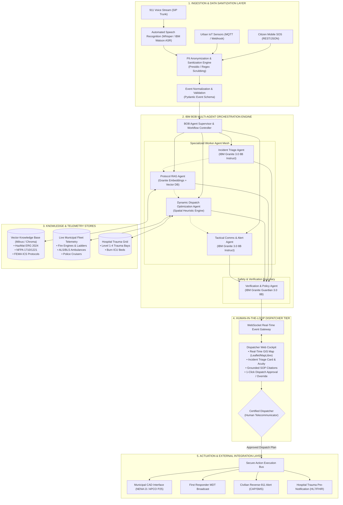
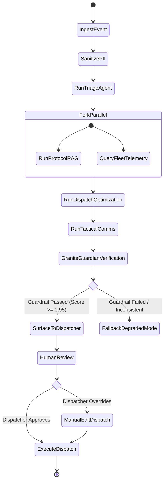
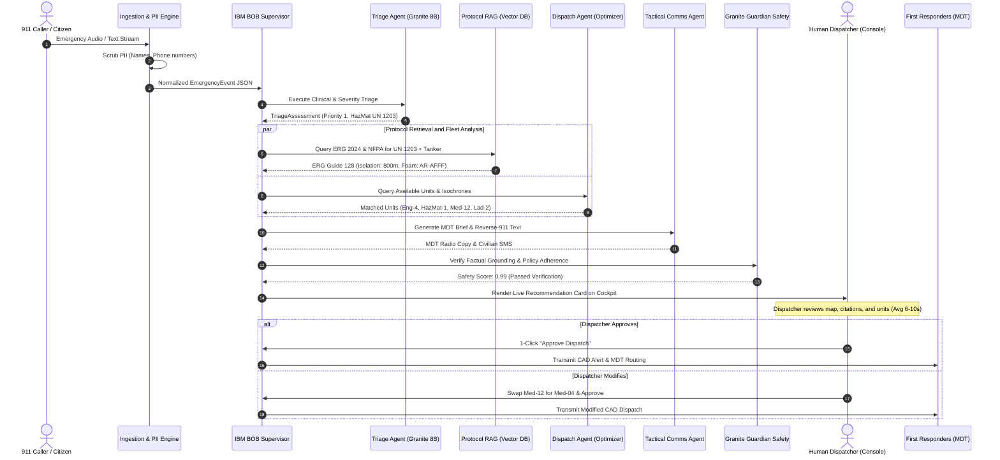

# ResQ-AI System Architecture Specification

## 1. Architectural Philosophy & Principles

The ResQ-AI architecture is engineered specifically for **safety-critical, fault-tolerant municipal emergency dispatching**. Public safety answering points (PSAPs) cannot tolerate non-deterministic failures, ungrounded hallucinations, or opaque black-box recommendations. As such, ResQ-AI is designed around five foundational architectural pillars:

1. **Safety-First Determinism**: Generative foundation models (IBM Granite) are strictly bound to structured output schemas (JSON/Pydantic) and audited by a dedicated safety model (IBM Granite Guardian) before presentation to users.
2. **Knowledge-Grounded Retrieval (RAG)**: Zero ungrounded clinical, tactical, or hazardous materials guidance. Every recommendation must link to verified municipal SOPs, NFPA standards, or the US DOT HazMat ERG 2024.
3. **Decoupled Agentic Mesh**: Monolithic prompts are replaced with specialized micro-agents coordinated by an **IBM BOB** state machine. Each agent possesses a single bounded context (Triage, Protocol Retrieval, Dispatch Optimization, Tactical Comms).
4. **Human-In-The-Loop (HITL) Imperative**: AI proposes; certified human telecommunicators dispose. The system accelerates human decision-making rather than replacing human authority.
5. **Graceful Degradation & Resilience**: If network connectivity to external LLM endpoints is severed, the system automatically falls back to an in-memory deterministic rule-based heuristic engine with zero downtime.

---

## 2. End-to-End System Topology



---

## 3. Subsystem Layer Specifications

### 3.1 Layer 1: Ingestion & Data Sanitization Layer
* **Protocol Support**:
  * SIP/RTP Voice Streams converted via low-latency speech-to-text (ASR) producing streaming timestamped transcripts.
  * HTTPS/REST citizen web reports with geolocations, photographs, and casualty checklists.
  * MQTT/Webhook payloads from urban sensors (acoustic gunshot detection, flood depth gauges, industrial chemical sniffer nodes).
* **PII Redaction Pipeline**:
  * Ingested text is processed through an in-memory token-scrubber.
  * Phone numbers, social security numbers, full legal names, and exact private residential unit identifiers are transformed into ephemeral privacy-preserving tokens (`[PERSON_1]`, `[PHONE_MASKED]`).
  * Tactical geospatial data (street names, cross-streets, landmarks, hazardous facility codes) is explicitly preserved.

### 3.2 Layer 2: IBM BOB Multi-Agent Orchestration Layer
Orchestrated via IBM BOB (Build on BOB / watsonx workflow pattern), the agent engine maintains an explicit directed acyclic graph (DAG) state machine:



### 3.3 Layer 3: Knowledge Base & RAG Subsystem
* **Storage Engine**: Embedded persistent vector database (ChromaDB / Milvus) paired with a high-speed BM25 inverted lexical index.
* **Embeddings**: `ibm/granite-embedding-125m-english` generating 768-dimensional normalized dense vectors.
* **Corpus Segmentation**: 
  * Granular chunking: 512 tokens with 64-token overlap.
  * Rich metadata headers: `{doc_id, standard, section, hazard_type, initial_isolation_distance_m, updated_at}`.
* **Query Routing**:
  * Semantic search retrieves conceptual matches (e.g., "how to extinguish electric vehicle fire").
  * Lexical BM25 search retrieves exact alphanumeric standard identifiers (e.g., "UN 1017 Chlorine", "NFPA 1710 Section 5.2").
  * Results are fused via Reciprocal Rank Fusion (RRF).

### 3.4 Layer 4: Presentation & Human-in-the-Loop Cockpit
* **Frontend Technology**: High-performance single-page web cockpit built with modern semantic HTML5, Tailwind CSS, Leaflet/MapLibre GIS mapping, and asynchronous WebSockets.
* **Dispatcher Capabilities**:
  * Multi-incident radar feed sorted by clinical severity.
  * Grounded reasoning panel showing exact text excerpts from retrieved SOPs.
  * Interactive unit assignment map with estimated arrival time (ETA) isochrones.
  * Instant 1-click confirmation or granular apparatus re-assignment controls.

### 3.5 Layer 5: Downstream Actuation & Gateway Layer
* **NENA i3 / CAD Integration**: Formats approved dispatch instructions into standard APCO/NENA compliant JSON/XML payloads for legacy Computer-Aided Dispatch platforms (Hexagon, Motorola, CentralSquare).
* **Responder MDT Broadcast**: Sends formatted tactical briefs directly to first responder ruggedized vehicle displays.
* **Civilian Alert Gateway**: Outputs standardized Common Alerting Protocol (CAP v1.2) XML feeds for wireless emergency alerts (WEA) and reverse-911 SMS broadcasters.

---

## 4. Formal Data Contracts & JSON Schemas

All inter-agent communication in ResQ-AI is governed by strict Pydantic schemas:

### 4.1 Ingested Emergency Event Schema
```json
{
  "$schema": "https://json-schema.org/draft/2020-12/schema",
  "title": "EmergencyEvent",
  "type": "object",
  "properties": {
    "event_id": { "type": "string", "format": "uuid" },
    "timestamp": { "type": "string", "format": "date-time" },
    "source_type": { "type": "string", "enum": ["911_CALL", "CITIZEN_SOS", "IOT_SENSOR", "MUNICIPAL_CCTV"] },
    "raw_transcript": { "type": "string" },
    "sanitized_transcript": { "type": "string" },
    "location": {
      "type": "object",
      "properties": {
        "address": { "type": "string" },
        "cross_street": { "type": "string" },
        "latitude": { "type": "number" },
        "longitude": { "type": "number" },
        "zone_id": { "type": "string" }
      },
      "required": ["latitude", "longitude"]
    }
  },
  "required": ["event_id", "timestamp", "source_type", "sanitized_transcript", "location"]
}
```

### 4.2 Triage Agent Output Schema
```json
{
  "$schema": "https://json-schema.org/draft/2020-12/schema",
  "title": "TriageAssessment",
  "type": "object",
  "properties": {
    "incident_category": { 
      "type": "string", 
      "enum": ["STRUCTURE_FIRE", "HAZMAT_SPILL", "MASS_CASUALTY", "ACTIVE_THREAT", "FLASH_FLOOD", "CARDIAC_ARREST", "VEHICLE_COLLISION"] 
    },
    "severity_level": { "type": "string", "enum": ["PRIORITY_1_CRITICAL", "PRIORITY_2_URGENT", "PRIORITY_3_DELAYED", "PRIORITY_4_MINOR"] },
    "severity_score": { "type": "integer", "minimum": 0, "maximum": 100 },
    "trapped_individuals": { "type": "integer", "minimum": 0 },
    "estimated_casualties": { "type": "integer", "minimum": 0 },
    "identified_hazards": {
      "type": "array",
      "items": { "type": "string" }
    },
    "clinical_justification": { "type": "string" }
  },
  "required": ["incident_category", "severity_level", "severity_score", "trapped_individuals", "estimated_casualties", "identified_hazards", "clinical_justification"]
}
```

### 4.3 Dispatch Plan Schema
```json
{
  "$schema": "https://json-schema.org/draft/2020-12/schema",
  "title": "DispatchRecommendation",
  "type": "object",
  "properties": {
    "dispatch_id": { "type": "string", "format": "uuid" },
    "recommended_units": {
      "type": "array",
      "items": {
        "type": "object",
        "properties": {
          "unit_id": { "type": "string" },
          "unit_type": { "type": "string", "enum": ["ENGINE", "LADDER", "RESCUE_SQUAD", "AMBULANCE_ALS", "AMBULANCE_BLS", "HAZMAT_TENDER", "POLICE_PATROL"] },
          "station_id": { "type": "string" },
          "estimated_arrival_sec": { "type": "integer" },
          "assigned_role": { "type": "string" }
        },
        "required": ["unit_id", "unit_type", "station_id", "estimated_arrival_sec", "assigned_role"]
      }
    },
    "target_hospital": {
      "type": "object",
      "properties": {
        "hospital_id": { "type": "string" },
        "name": { "type": "string" },
        "trauma_level": { "type": "integer", "minimum": 1, "maximum": 4 },
        "available_trauma_bays": { "type": "integer" },
        "eta_minutes": { "type": "number" }
      }
    },
    "perimeter_isolation_radius_meters": { "type": "number" },
    "sops_referenced": {
      "type": "array",
      "items": {
        "type": "object",
        "properties": {
          "document_id": { "type": "string" },
          "section": { "type": "string" },
          "citation_text": { "type": "string" }
        }
      }
    }
  },
  "required": ["dispatch_id", "recommended_units", "perimeter_isolation_radius_meters", "sops_referenced"]
}
```

---

## 5. Sequence Diagram: Emergency Event Lifecycle



---

## 6. Resilience, Fault Tolerance & High Availability

| Failure Mode | Detection Mechanism | Automated Mitigation Strategy |
| :--- | :--- | :--- |
| **External LLM Cloud API Latency Spike (> 4.0s)** | In-flight request deadline timer | Automatically aborts remote call and triggers local quantized Granite container or cached heuristic fallback. |
| **Vector DB Index Degradation** | Health check probe ping every 5s | Direct fallback to static in-memory BM25 index of core emergency protocols. |
| **Malformed LLM JSON Payload** | Pydantic validation error exception | Automated BOB repair loop: re-prompts model with validation error or falls back to rule-based parser. |
| **Granite Guardian Flagged Hallucination** | Guardrail confidence score $< 0.95$ | Mark recommendation as `UNVERIFIED_AI`, suppress automated unit pre-selection, and alert dispatcher to perform manual lookup. |
| **Total Telecommunication Blackout** | Local PSAP edge deployment | ResQ-AI runs entirely within an air-gapped on-premise local area network (LAN) using edge-hosted Granite models. |

---

## 7. Infrastructure Deployment & Scalability

ResQ-AI is packaged as a cloud-native, microservices-based application deployable across **Red Hat OpenShift on IBM Cloud** or on-premises municipal edge infrastructure:

* **Container Architecture**:
  * `resq-ai-gateway`: Reverse proxy, SSL termination, rate limiting, and WebSocket connection pool.
  * `resq-ai-orchestrator`: Python FastAPI / IBM BOB workflow state machine service.
  * `resq-ai-vectorstore`: ChromaDB / Milvus distributed vector storage cluster.
  * `resq-ai-frontend`: Nginx container serving static responsive UI assets with real-time WebSocket bindings.
* **Resource Footprint**:
  * Granite 3.0 8B model instances can run on 1x NVIDIA A10G (24GB VRAM) or IBM Cloud watsonx serverless endpoint.
  * Total microservice footprint (excluding LLM weights): $< 2$ vCPUs, $< 4$ GB RAM, allowing deployment on standard municipal server racks.
